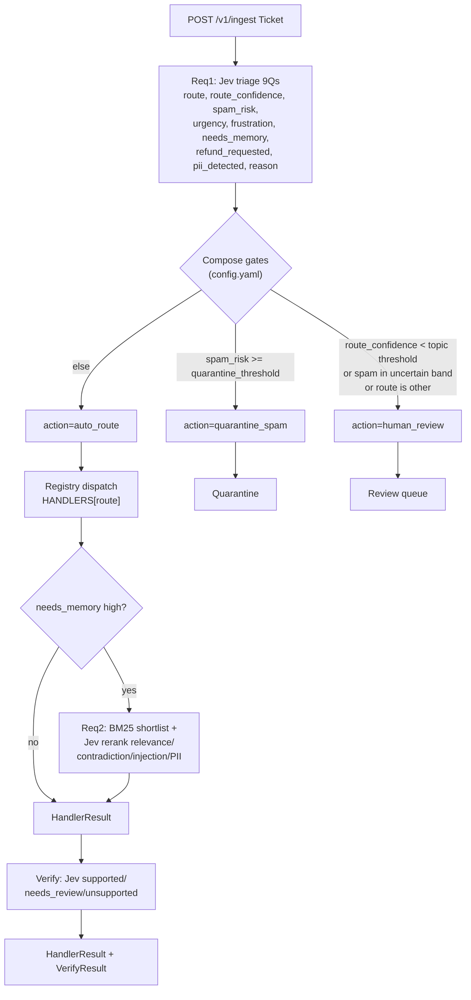

# PulseDesk OS — Architecture

## Flow

## Components

| Component | File | Role |
|---|---|---|
| Contracts | `backend/schemas.py` (domain) + request/response models in `backend/main.py` | Frozen Pydantic models: `Ticket`, `TriageResult`, `MemoryHit`, `VerifyResult`, `HandlerResult`. Single source of truth per layer. |
| Handlers | `backend/handlers/builtins.py` | 5 handler classes (one per route), registered by side effect. Extend with new files, never branch core triage. |
| Jev client | `backend/jev_client.py` | Sole entry point for System One requests. Builds `{state, questions}` payloads, reads model/timeout from `config.yaml`, requires `TYPESAFE_API_KEY`. |
| Registry | `backend/registry.py` | `HANDLERS` dict + `register()`. `Handler` protocol (`can_handle`, `run`). `MemoryBackend` protocol (`store`, `search_bm25`, `list`, `delete`, `count`). |
| Memory backends | `backend/memory_backends/` | Pluggable store. SQLite now, Postgres/supermemory later. Lexical `search_bm25`, Jev reranks afterwards. |
| HTTP API | `backend/main.py` | FastAPI app: `/healthz`, `/v1/triage`, `/v1/ingest`, `/v1/orchestrate`, `/v1/memory/*`, `/v1/verify`. Request-id middleware, 503 on missing key. |
| Orchestrator | `backend/orchestrator.py` | Additive chain: `orchestrate_live` (triage→conditional recall→dispatch→draft→verify), pure `orchestrate_offline`, idempotent `seed_default_docs`. |
| MCP | `backend/mcp_server.py` | FastMCP tools wrapping the same schemas. |
| Plugin | `.claude-plugin/plugin.json`, `skills/`, `agents/`, `.mcp.json` | Superpowers-style packaging: `/pulsedesk:triage`, `/pulsedesk:orchestrate`, `/pulsedesk:memory`, reviewer agent, bundled MCP server. |
| Config | `config.yaml` | Tunable thresholds and weights: routing, spam, memory, skill-suggest gates. |
| Frontend | `frontend/` | Vite+React ops console (Triage/Pipeline/Review/System). |
| Evals | `evals/` | `golden-tickets.json` + confidence-plot tuning workflow. |

## Extensibility rules

1. Open/Closed registry. Add a route by adding a file under
   `backend/handlers/` and calling `register()`. Never branch core triage
   on route names.
2. Frozen Pydantic everywhere. `Frozen` base sets `frozen=True,
   extra="forbid"`. Shape changes go in `schemas.py`, never as ad-hoc dicts
   in handlers.
3. `config.yaml`, not code. Thresholds, weights, `top_k`, gate cutoffs live
   in config. Code reads them via `load_config()`.
4. `/v1` versioning. Any schema shape change bumps the API version prefix.
   Never rename existing `Route` members; add new ones.

## Confidence gating

`TriageResult` carries probabilities in 0..1. `config.yaml` converts them to
a discrete `TriageAction`:

- `quarantine_spam`: `spam_risk >= spam.quarantine_threshold` (default 0.60).
  Spam score itself is a weighted sum of Jev sub-judgments
  (`requests_credentials` 0.45, `sender_identity_mismatch` 0.30,
  `unexpected_reward` 0.25).
- `human_review`: `route_confidence < routing.topic_confidence_threshold`
  (default 0.75); spam risk strictly between `uncertain_low` (0.40) and
  `uncertain_high` (0.60) — edges fall through (0.40 to the confidence gate,
  0.60 to quarantine); or route `other`, which has no owning team and always
  reviews (`routing.other_always_review`).
- `auto_route`: everything above the gates. The ticket goes to
  `HANDLERS[route]`; if `needs_memory >= orchestration.needs_memory_threshold`
  (default 0.60), Req2 recall runs and filters hits to
  `relevance >= memory.keep_relevance_threshold` (0.70), dropping
  `injection >= memory.drop_injection_threshold` (0.30) and flagging
  `contradicts >= memory.contradict_flag_threshold` (0.60) before the
  handler drafts.

Tune in `config.yaml` using the eval workflow in `evals/README.md`.
Removed dead keys are gone on purpose: `destructive_confidence_threshold`
and `uncertain_floor` were documented but never enforced, so config no
longer carries them.
