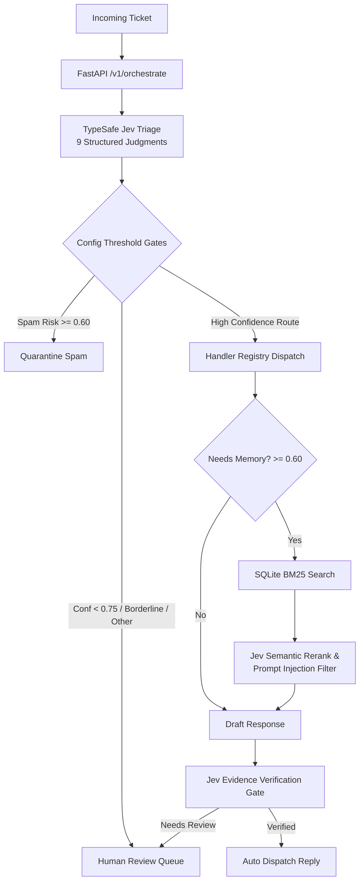

# PulseDesk OS

[](https://github.com/Chandan062311/PulseDeskOS/actions/workflows/ci.yml)
[](LICENSE)
[](https://www.python.org/downloads/)
[](https://nodejs.org/)
[](https://typesafe.ai/)
[](docker-compose.yml)

An open-source, auditable support operations console and multi-agent orchestrator powered by [TypeSafe Jev](https://typesafe.ai/).

PulseDesk turns incoming support tickets into typed judgments, deterministic policy gates, memory-backed actions, and verified customer replies.

> **Core Philosophy:** Code owns the workflow. Jev owns the judgments.

---

## Why PulseDesk OS?

Most agent architectures let large language models decide what step to run next, hoping an open-ended prompt will not hallucinate, loop infinitely, or leak customer data.

**PulseDesk OS inverts that paradigm:**

1. **Deterministic Control Flow in Code:** State machines, branching, routing gates, and handler dispatching are written in standard, testable Python.
2. **Narrow, Structured Judgments via Jev:** Fast (~1s), typed System One models evaluate specific questions (route classification, spam probability, urgency, PII presence, memory relevance, response verification).
3. **Transparent & Auditable:** Every decision carries explicit confidence scores, decision gates, and verifiable reasoning instead of hidden LLM scratchpads.
4. **Offline First:** Runs out of the box with mock heuristics for offline development—no API key required to test the core pipeline. Adding `TYPESAFE_API_KEY` unlocks live production judgments.

---

## Architecture & Data Flow



See [ARCHITECTURE.md](ARCHITECTURE.md) for full component specifications, data schemas, and extension patterns.

---

## Quickstart (Under 60 Seconds)

### Option A: Docker Compose (Full Stack)

Run the backend API and the production React console with persistent SQLite storage:

```bash
git clone https://github.com/Chandan062311/PulseDeskOS.git
cd PulseDeskOS

# Optionally set TYPESAFE_API_KEY in .env for live Jev calls
cp .env.example .env

docker compose up --build -d
```

- **Operations Console (UI):** [http://localhost:8080](http://localhost:8080)
- **FastAPI REST API & Docs:** [http://localhost:8000/docs](http://localhost:8000/docs)
- **Liveness Probe:** `curl http://localhost:8000/healthz`

### Option B: Local Development

Requirements: Python 3.11+, Node.js 22+.

```bash
git clone https://github.com/Chandan062311/PulseDeskOS.git
cd PulseDeskOS

make setup       # creates .venv, installs backend + dev deps, installs UI deps
make api         # starts FastAPI on http://localhost:8000
make ui          # starts Vite console on http://localhost:5173
```

### Offline Mode vs. Live Jev Mode

- **Zero-Config Offline Mode:** Without an API key, `/v1/triage` and `/v1/ingest` run offline using deterministic keyword heuristics. Perfect for local dev and automated CI testing.
- **Live Mode:** Obtain an API key at [console.typesafe.ai/keys](https://console.typesafe.ai/keys) and set `TYPESAFE_API_KEY` in `.env`. Live endpoints (`/v1/orchestrate`, `/v1/memory/recall`, `/v1/verify`) will automatically use real-time Jev models.

---

## End-to-End Demo Simulation

Run the 5-ticket Monday morning support storm simulation against a running API:

```bash
python sandbox/run_demo.py
```

This exercises the full live pipeline across real-world ticket scenarios:
1. **Critical Outage (API 500s):** `bug_report` &rarr; high urgency &rarr; `auto_route`
2. **Duplicate Charge:** `billing` &rarr; high confidence &rarr; `auto_route`
3. **VPN Provisioning:** `it_access` &rarr; credential check safe &rarr; `auto_route`
4. **Phishing & Credential Theft:** Suspicious bonus offer &rarr; high spam risk &rarr; `quarantine_spam`
5. **Vague / Ambiguous Report:** Low classification confidence &rarr; routed to `human_review`

Results are logged with full traces to `sandbox/report.json` (gitignored).

---

## Operations Console UI

The web operations console (`frontend/`) provides four dense, responsive views:

1. **Triage Composer (`/triage`):** Interactive ticket composer with real-time feedback, calibrated meter gauges for route confidence, spam risk, urgency, and frustration, and full 9-question breakdown.
2. **Pipeline Inspector (`/pipeline`):** Live 5-stage trace showing Triage &rarr; Memory Recall &rarr; Handler Dispatch &rarr; Draft Reply &rarr; Verification Verdict.
3. **Human Review Queue (`/review`):** Dedicated operator queue for tickets gated to human review due to low routing confidence, borderline spam scores, or unassigned categories.
4. **System Health (`/system`):** Real-time API connection status, live Jev key detection, active configuration thresholds, and endpoint directory.

---

## REST API Reference

Interactive OpenAPI Swagger documentation is available at `http://localhost:8000/docs`.

| Method | Endpoint | Description | Mode |
| --- | --- | --- | --- |
| `GET` | `/healthz` | Health check probe | Offline |
| `GET` | `/v1/status` | Reports whether live Jev key is loaded | Offline |
| `POST` | `/v1/triage` | Evaluate 9 triage judgments and apply policy gates | Offline / Live (`?live=true`) |
| `POST` | `/v1/ingest` | Triage ticket and dispatch registered handler | Offline / Live (`?live=true`) |
| `POST` | `/v1/orchestrate` | Full chain: Triage &rarr; Recall &rarr; Dispatch &rarr; Draft &rarr; Verify | Live Jev |
| `POST` | `/v1/memory/store` | Store tenant-scoped memory document | Offline |
| `POST` | `/v1/memory/seed` | Seed default operational policies idempotently | Offline |
| `POST` | `/v1/memory/recall` | Retrieve candidates via BM25 and rerank via Jev | Live Jev |
| `GET` | `/v1/memory/list` | List memories for a tenant | Offline |
| `GET` | `/v1/memory/count` | Count total memories for a tenant | Offline |
| `DELETE` | `/v1/memory/{id}` | Delete tenant memory (tenant ID strictly required) | Offline |
| `POST` | `/v1/verify` | Verify draft response against recalled evidence | Live Jev |

---

## Claude Code Plugin & FastMCP Tools

PulseDesk OS is packaged as a ready-to-use **Claude Code plugin** and **FastMCP server**:

### Slash Commands
- `/pulsedesk:triage <ticket>` — Run 9-question triage and print gating decisions.
- `/pulsedesk:orchestrate <ticket>` — Execute the complete orchestration pipeline.
- `/pulsedesk:memory <query>` — Search and inspect tenant memory.

### FastMCP Tools
The MCP server (`backend/mcp_server.py`) exposes 5 tools to any MCP-compliant client (Claude Desktop, Claude Code, Cursor):
- `triage_ticket(subject, message, ...)`
- `recall_memory(query, tenant_id, ...)`
- `add_memory(text, type, tenant_id, ...)`
- `list_memories(tenant_id, limit)`
- `verify_response(draft, evidence, ...)`

### Using with Claude Code
```bash
# Test the plugin locally:
claude --plugin-dir .

# Validate the plugin packaging:
claude plugin validate .
```

### Standalone FastMCP Server
```bash
make mcp
```

---

## Production Deployment

### 1. Docker & Docker Compose
Self-host on any Linux server, AWS EC2, or DigitalOcean Droplet:
```bash
cp .env.example .env
docker compose up -d
./scripts/smoke.sh
```

### 2. Render Blueprint
Deploy the backend API with persistent SQLite disk storage in one click using [render.yaml](render.yaml):
1. Fork or push this repository to GitHub.
2. In Render, select **New +** &rarr; **Blueprint** &rarr; connect your repository.
3. Configure `TYPESAFE_API_KEY` in the Render environment settings.

### 3. Vercel Frontend
Deploy the Vite operations console on Vercel using [frontend/vercel.json](frontend/vercel.json):
1. Connect the repository to Vercel.
2. Set Root Directory to `frontend`.
3. Set environment variable `VITE_API=https://your-api-domain.com`.

---

## Configuration & Customization

All operational thresholds and model weights live in [`config.yaml`](config.yaml):

- **Routing Gates:** Set `routing.topic_confidence_threshold: 0.75` and `routing.other_always_review: true`.
- **Spam Scoring:** Weighted sum of credential requests (0.45), sender mismatch (0.30), and unexpected reward (0.25). Quarantines above 0.60; routes borderline scores (0.40–0.60) to human review.
- **Memory Filtering:** Drops prompt injections above `memory.drop_injection_threshold: 0.30`; retains relevant evidence above 0.70.
- **Auto-Capture:** Set `memory.auto_capture_resolved: true` to automatically store resolved support resolutions as future memory context.

### Adding Custom Handlers
Handlers follow the Open/Closed principle. To add a new ticket category:
1. Create `backend/handlers/my_handler.py`.
2. Implement your handler logic and register it:
   ```python
   from backend.registry import register
   from backend.schemas import HandlerResult, Ticket, Customer

   @register("my_route")
   def handle_my_route(ticket: Ticket, customer: Customer) -> HandlerResult:
       return HandlerResult(handler="my_route", status="resolved", action_taken="...")
   ```
3. Add the route name to `config.yaml`.

---

## Quality Assurance & Verification

Every pull request and release is validated through strict automated checks:

```bash
make test       # runs pytest (59 tests), ruff lint/format, and strict mypy
make build-ui   # verifies Vite production build
make secrets    # scans repo for leaked credentials or live tokens
make smoke      # automated end-to-end HTTP integration smoke tests
```

---

## Security & Data Privacy

- **Single Secret Architecture:** Only `TYPESAFE_API_KEY` is required for live production calls.
- **Multi-Tenant Isolation:** All memory queries and deletes are strictly scoped by `tenant_id`. Deleting without matching tenant ownership fails safely.
- **Prompt Injection Defense:** Recalled memories are evaluated by Jev for prompt injection attacks before being fed into drafting agents.
- **Credential & Secret Protection:** Live credentials, SQLite databases, and sandbox test artifacts are excluded from version control.

---

## Contributing

We welcome contributions! Please review [CONTRIBUTING.md](CONTRIBUTING.md) for architectural guidelines, coding standards, and PR requirements.

---

## License

PulseDesk OS is open-source software licensed under the [MIT License](LICENSE).
